# ESP32-RC-car
RC car, which you can control from your PC.

![image][car]
 
## Things required

`Before we start you can use any other similar parts to build your car. You just need to adjust your car according to it.`

| Item | Image |
| --- | --- |
| RC car |  |
| L298N motor dc motor driver | 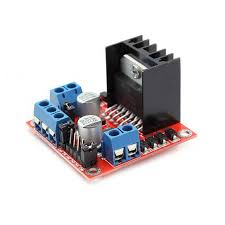 |
| Antenna | 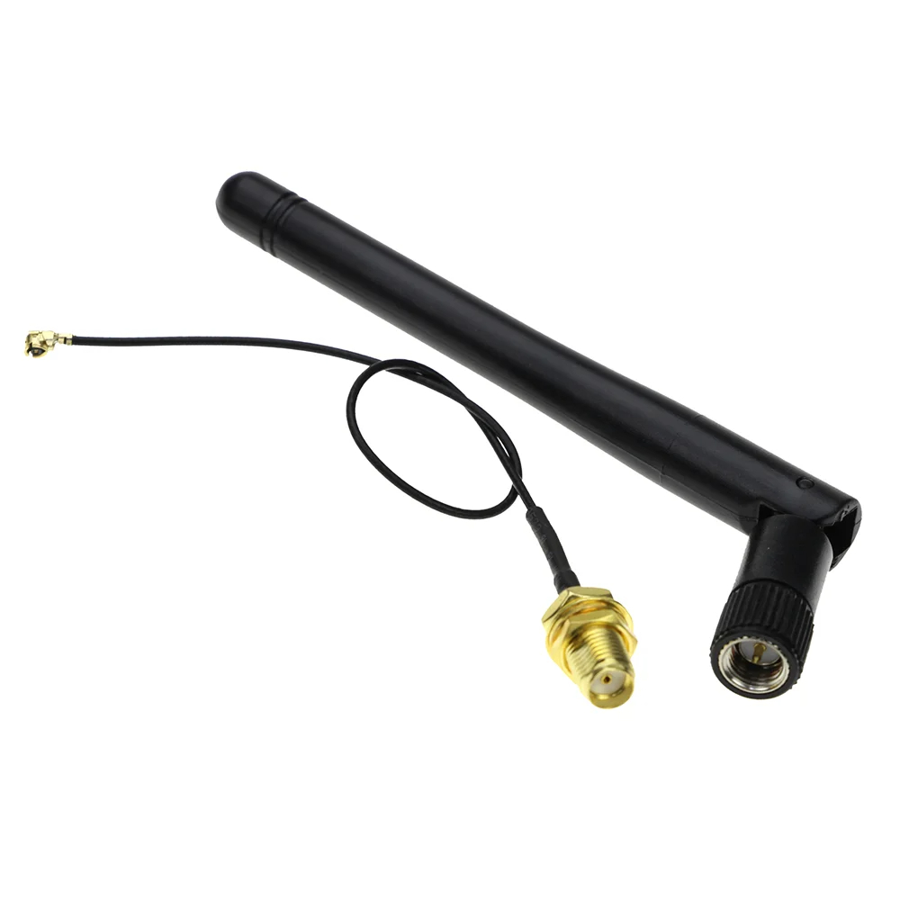 |
| Buck Convertor | 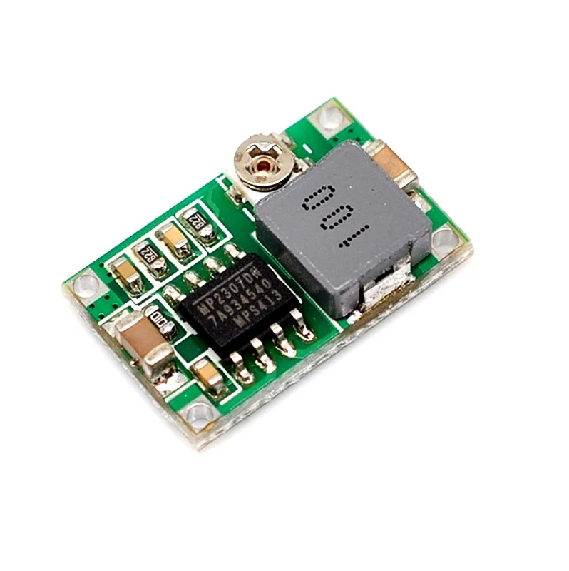 |
| LIPO battery | 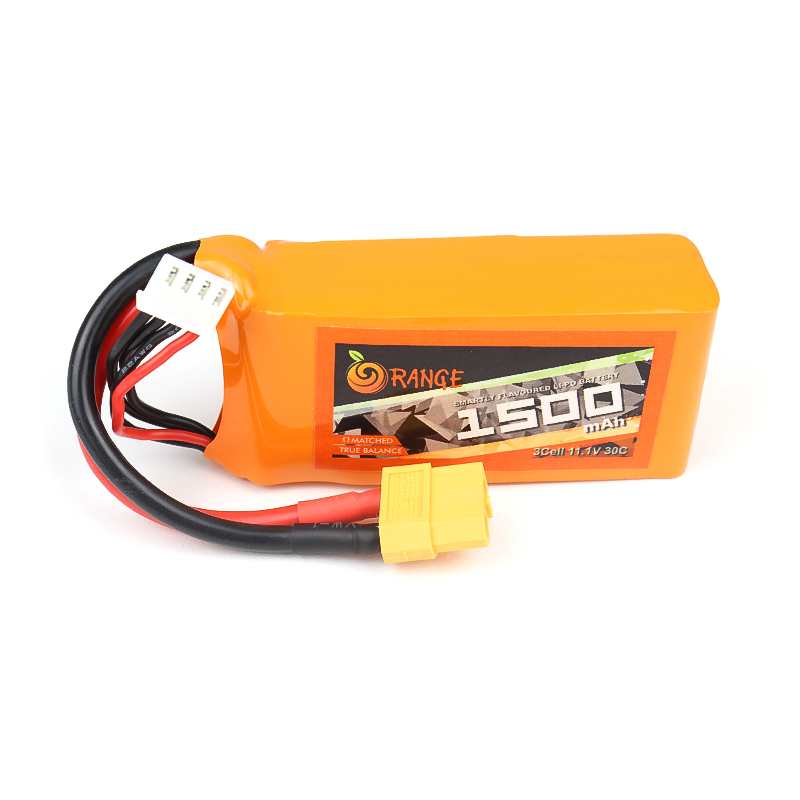 |
| ESP32 | 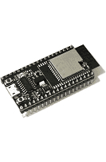 |
| ESP32 CAM | 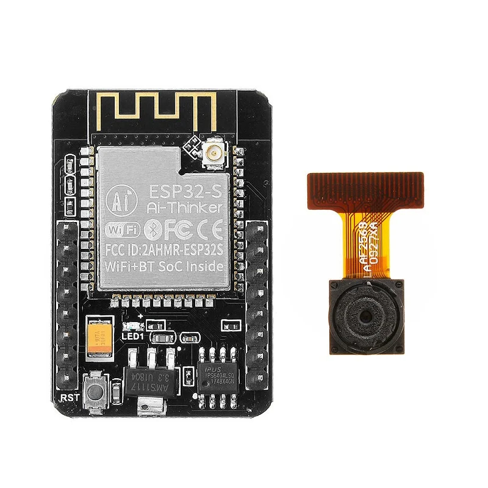 |
| Servo motor | 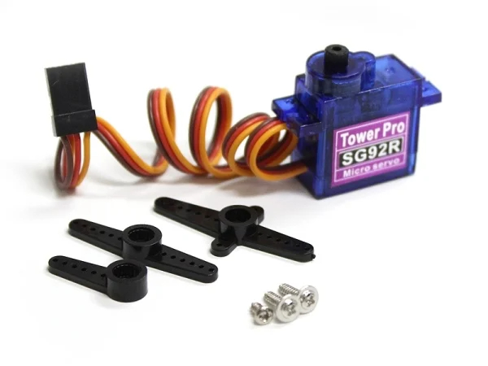 |
| Header pins | 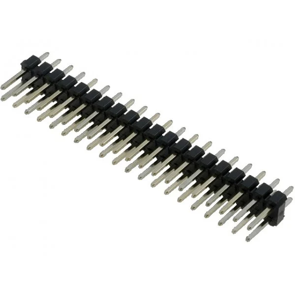 |
| Wires |  |
| PCB board | 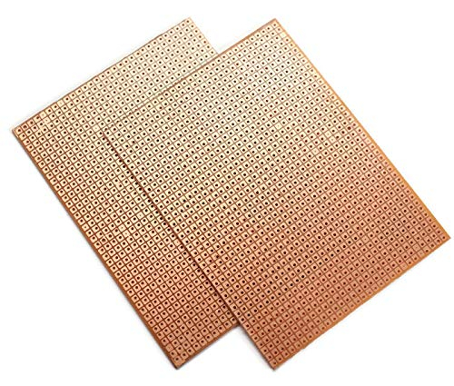 |

## Modifing the rc car

1. Open the outer shell.
   
   
2. Remove all wiring and circuits.

    

3. Cut slot in battery holder, for fitting lipo battery.
    
    
    

4. Remove steering motor.(we will replace it with servo)
    
    

5. Cut slots to accommodate servo motor.
   
    
    

6. Cut slots in servo arm like this for connecting to stering shaft.

    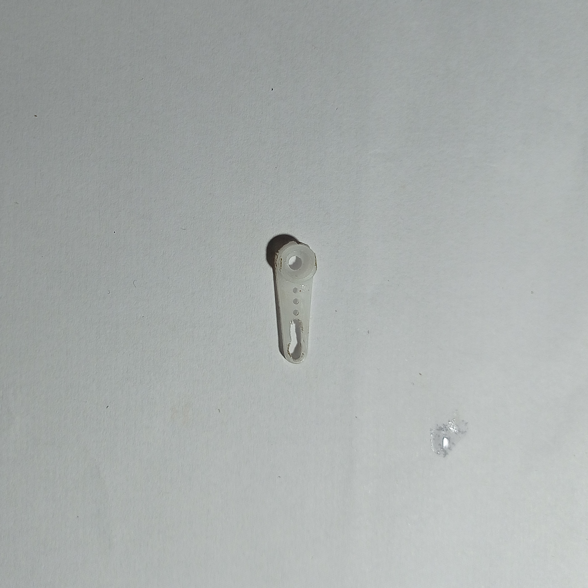

7. Fix the servo to chassis with the help of few spacers.
    
    
8. Put back the cover.

    
9. Follow the schematic and solder the parts.

    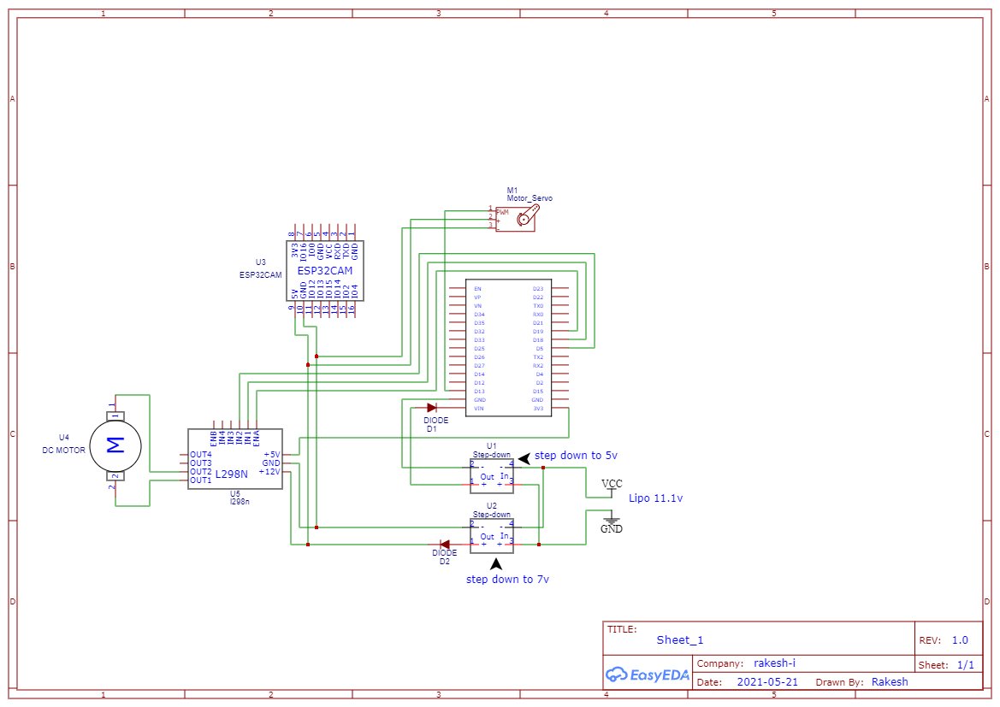

10. If you have done everything right it should look something like this.
     
     
     
     
     
     
     
12. If you are struck follow the following video.

## Code

1. Follow this [link](), where you can find how to setup client-server socket using micropython.
2. Now that you know how to setup socket for wireless connection. Modify files in esp32-files to setup your connection. 
3. Copy all the files in folder esp32 files to your esp32.
4. Confirm every thing is working before putting esp32 on car.
5. Now, turn on your car, wait for it to connect to your wifi. Once connected run client.py
6. Once connection is made you can drive the car using AWSD keys on keyboard.
7. You can change speed by changing the motorSpeed() function in server.py
8. If direction is reversed, flip the sign of motorSpeed() values.

## Contribution

Feel free to point out issues. You can contribute to this repo to improve it.

[rc-car]: media/rc-car(1).jpg
[l298n]: media/img.jpg
[antenna]: media/img.jpg
[buck_convertor]: media/img.jpg
[lipo]: media/img.jpg
[esp32cam]: media/img.jpg
[servo]: media/img.jpg
[header]: media/img.jpg
[wires]: media/img.jpg
[pcb]: media/img.jpg
[esp32]: media/img.jpg
[car]: media/img.jpg
